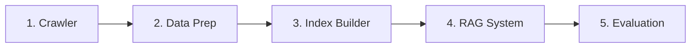

# Project Structure - Quick Reference

## 🗂️ 디렉토리 개요

```
test/
├── 📄 README.md                    # 메인 프로젝트 문서
├── 📄 CLEANUP_SUMMARY.md          # 프로젝트 정리 요약
├── 📄 PROJECT_STRUCTURE.md        # 이 파일
├── 📄 config.yaml                 # 메인 설정
├── 📄 requirements.txt            # Python 의존성
│
├── 📁 docs/                       # 모든 프로젝트 문서
├── 📁 crawler/                    # 웹 크롤러 (Extended)
├── 📁 data/                       # 크롤링된 데이터
├── 📁 experiments/rag_pipeline/   # RAG 시스템
└── 📁 results/                    # 평가 결과
```

## 🚀 주요 실행 파일

### 1. 웹 크롤러 (Extended)
**위치:** [crawler/run_crawl_extended.py](crawler/run_crawl_extended.py)

**기능:** Git, Python, Docker, AWS 문서 크롤링

**실행:**
```bash
cd crawler
python run_crawl_extended.py
```

**설정:** [crawler/config/settings_extended.py](crawler/config/settings_extended.py)

---

### 2. RAG Pipeline (Optimized)
**위치:** [experiments/rag_pipeline/answerer_v2_optimized.py](experiments/rag_pipeline/answerer_v2_optimized.py)

**기능:**
- Hybrid Search (Dense + Sparse + RRF)
- 2-Stage Reranking (BGE-reranker-v2-m3 + large)
- LLM 기반 Context Quality Filter
- URL Source Attribution

**실행:**
```bash
cd experiments/rag_pipeline
python answerer_v2_optimized.py --config config/enhanced.yaml
```

**설정:** [experiments/rag_pipeline/config/enhanced.yaml](experiments/rag_pipeline/config/enhanced.yaml)

---

### 3. LangGraph RAG System (NEW)
**위치:** [experiments/rag_pipeline/langgraph_rag/](experiments/rag_pipeline/langgraph_rag/)

**기능:**
- Adaptive RAG (Query Routing)
- Corrective RAG (Document Grading + Query Transformation)
- Self-RAG (Hallucination Check + Answer Grading)
- LangSmith Tracking 지원

**실행:**
```bash
cd experiments/rag_pipeline/langgraph_rag

# 단일 질문
python -m langgraph_rag.main "git rebase란 무엇인가요?"

# 대화형 모드
python -m langgraph_rag.main

# LangSmith 추적 활성화
export LANGSMITH_TRACING=true
export LANGSMITH_API_KEY=your_api_key
python -m langgraph_rag.main "질문"
```

**가이드:** [experiments/rag_pipeline/langgraph_rag/README.md](experiments/rag_pipeline/langgraph_rag/README.md)

---

## 📦 데이터 파이프라인

### 전체 워크플로우



### 단계별 실행

#### 1️⃣ 데이터 수집 (Crawler)
```bash
cd crawler
python run_crawl_extended.py
```
**출력:** `data/raw/{git,python,docker,aws}/`

#### 2️⃣ 데이터 준비
```bash
cd experiments/rag_pipeline
python data_prep.py --config config/enhanced.yaml
```
**출력:** `artifacts/rag_chunks.parquet`

#### 3️⃣ 벡터 인덱스 빌드
```bash
python index_builder.py --config config/enhanced.yaml
```
**출력:** `artifacts/chroma_db/`

#### 4️⃣ RAG 실행
```bash
# 기본 RAG (Optimized)
python answerer_v2_optimized.py --config config/enhanced.yaml

# 또는 LangGraph RAG
python -m langgraph_rag.main "질문"
```

#### 5️⃣ 평가 (RAGAS)
```bash
python run_ragas_evaluation.py
```
**출력:** `artifacts/ragas_evals/`

---

## 📚 문서 위치

### 메인 문서
- [README.md](README.md) - 프로젝트 개요
- [CLEANUP_SUMMARY.md](CLEANUP_SUMMARY.md) - 프로젝트 정리 요약
- [PROJECT_STRUCTURE.md](PROJECT_STRUCTURE.md) - 이 파일

### 기술 문서 (docs/)
- [ENHANCED_README.md](docs/ENHANCED_README.md) - RAG 시스템 상세 가이드
- [OPTIMIZATION_GUIDE.md](docs/OPTIMIZATION_GUIDE.md) - 최적화 가이드
- [SPEED_OPTIMIZATION_GUIDE.md](docs/SPEED_OPTIMIZATION_GUIDE.md) - 속도 최적화
- [RAGAS_EVALUATION_GUIDE.md](docs/RAGAS_EVALUATION_GUIDE.md) - RAGAS 평가 가이드

### 문제 해결
- [TROUBLESHOOTING_RTX5090.md](docs/TROUBLESHOOTING_RTX5090.md) - GPU 문제 해결
- [RUNPOD_SETUP.md](docs/RUNPOD_SETUP.md) - RunPod 설정
- [RAGAS_EVAL_FIXES.md](docs/RAGAS_EVAL_FIXES.md) - RAGAS 평가 수정사항

### 히스토리
- [CHANGES.md](docs/CHANGES.md) - 변경 이력
- [PIPELINE_VERIFICATION.md](docs/PIPELINE_VERIFICATION.md) - 파이프라인 검증
- [METADATA_FIX_FLOW.md](docs/METADATA_FIX_FLOW.md) - 메타데이터 수정 플로우

---

## 🔧 설정 파일

### 메인 설정
| 파일 | 용도 | 위치 |
|------|------|------|
| `config.yaml` | 프로젝트 전역 설정 | 루트 |
| `enhanced.yaml` | RAG 시스템 설정 (추천) | `experiments/rag_pipeline/config/` |
| `base.yaml` | RAG 기본 설정 | `experiments/rag_pipeline/config/` |
| `settings_extended.py` | 크롤러 설정 | `crawler/config/` |

### 주요 설정 항목 (enhanced.yaml)

```yaml
# 임베딩 모델
embedding:
  model_name: BAAI/bge-m3
  device: cuda
  batch_size: 32

# 검색 설정
retrieval:
  hybrid_dense_top_k: 50
  hybrid_sparse_top_k: 50
  rerank_top_k: 10

# Reranker 설정
rerankers:
  stage1:
    model_name: BAAI/bge-reranker-v2-m3
  stage2:
    model_name: BAAI/bge-reranker-large

# LLM 설정
llm:
  model_name: gpt-4.1
  temperature: 0.2
  max_new_tokens: 300

# Context Quality Filter
context_quality:
  enabled: true
  evaluator_model: gpt-4o-mini
```

---

## 🧪 테스트 및 평가

### 유닛 테스트
```bash
# GPU 진단
python experiments/rag_pipeline/diagnose_gpu.py

# 파이프라인 검증
python verify_pipeline.py

# Smoke 테스트
python experiments/rag_pipeline/smoke_test.py

# Enhanced 테스트
python experiments/rag_pipeline/test_enhanced.py
```

### 평가 스크립트
```bash
cd experiments/rag_pipeline

# RAGAS 평가
python run_ragas_evaluation.py

# 로컬 평가
python local_eval.py

# 벤치마크
python ragas_benchmark.py

# 파이프라인 비교
python compare_pipelines.py

# 문서 분석
python analyze_documents.py
```

---

## 📊 아티팩트 (Artifacts)

### 벡터 데이터베이스
**위치:** `experiments/rag_pipeline/artifacts/chroma_db/`

**내용:**
- 청크된 문서의 벡터 임베딩
- 메타데이터 (url, domain, length 등)

### RAGAS 평가 결과
**위치:** `experiments/rag_pipeline/artifacts/ragas_evals/`

**파일:**
- `ragas_eval_*.json` - 평가 결과 (JSON)
- `ragas_eval_*_report.txt` - 평가 리포트 (텍스트)
- `archive/` - 이전 평가 결과

---

## 🎯 Quick Start

### 처음 시작하는 경우

```bash
# 1. 의존성 설치
pip install -r requirements.txt

# 2. 데이터 크롤링
cd crawler
python run_crawl_extended.py

# 3. RAG 파이프라인 구축
cd ../experiments/rag_pipeline
python data_prep.py --config config/enhanced.yaml
python index_builder.py --config config/enhanced.yaml

# 4. RAG 시스템 실행 (둘 중 선택)

# 옵션 A: 기본 RAG (빠름)
python answerer_v2_optimized.py --config config/enhanced.yaml

# 옵션 B: LangGraph RAG (고품질, LangSmith 추적)
cd langgraph_rag
python -m langgraph_rag.main "git rebase란?"
```

### 이미 데이터가 있는 경우

```bash
# RAG 시스템만 실행
cd experiments/rag_pipeline

# 옵션 A: 기본 RAG
python answerer_v2_optimized.py --config config/enhanced.yaml

# 옵션 B: LangGraph RAG
cd langgraph_rag
python -m langgraph_rag.main
```

---

## 🔗 주요 링크

### LangGraph RAG
- [README](experiments/rag_pipeline/langgraph_rag/README.md) - 전체 가이드
- [LangSmith Dashboard](https://smith.langchain.com/) - 추적 대시보드

### 참고 자료
- [shlomoc/adaptive-rag-agent](https://github.com/shlomoc/adaptive-rag-agent) - 구현 베이스
- [LangGraph Docs](https://langchain-ai.github.io/langgraph/) - 공식 문서
- [RAGAS Docs](https://docs.ragas.io/) - 평가 프레임워크

---

## ❓ FAQ

### Q1: 어떤 RAG 시스템을 사용해야 하나요?

**A:**
- **빠른 응답이 필요한 경우:** `answerer_v2_optimized.py` (5초)
- **높은 품질이 필요한 경우:** `langgraph_rag` (7-10초)
- **디버깅/추적이 필요한 경우:** `langgraph_rag` + LangSmith

### Q2: ChromaDB를 찾을 수 없다는 에러가 나와요

**A:**
```bash
cd experiments/rag_pipeline
python data_prep.py --config config/enhanced.yaml
python index_builder.py --config config/enhanced.yaml
```

### Q3: GPU 메모리 부족 에러가 나와요

**A:** `config/enhanced.yaml`에서 설정 조정:
```yaml
embedding:
  batch_size: 16  # 기본 32에서 감소
rerankers:
  # stage2 비활성화 (메모리 절약)
  stage2:
    enabled: false
```

### Q4: LangSmith 추적이 안 됩니다

**A:**
```bash
# 환경변수 확인
echo $LANGSMITH_TRACING  # true여야 함
echo $LANGSMITH_API_KEY  # API 키 확인

# 환경변수 설정
export LANGSMITH_TRACING=true
export LANGSMITH_API_KEY=your_api_key
export LANGSMITH_PROJECT=my-project
```

---

**작성:** Claude Code
**날짜:** 2025-12-01
**버전:** 1.0
